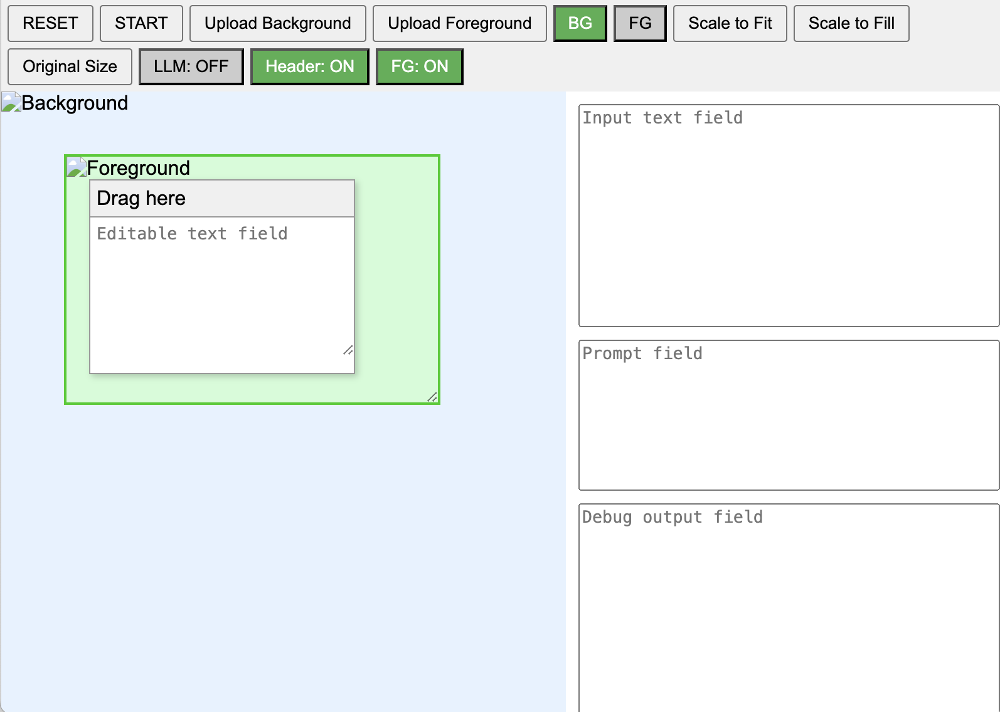

# AIDemoUI

Simple web UI for demonstrating AI (LLM) apps.

Allows for uploading background image and optional foreground image,
and moving textboxes on top of that to demonstrate LLM reponses inside
a UI.



## Example - using this projects github page as background image

Here the background image of the github page is loaded, and the
foreground image is hidden, and the text field is moved over the name
of the project in the README.md


## Prerequisites

- [Node.js](https://nodejs.org/) (version 14 or later)
- npm (comes with Node.js)

## Getting Started

1. **Clone the Repository**

   ```sh
   git clone https://github.com/your-username/AIDemoUI.git
   cd AIDemoUI
   ```

2. **Install Dependencies**

   Ensure you are in the project directory (`AIDemoUI`), then run:

   ```sh
   npm install
   ```

3. **Running the Application**

   Start the Electron application:

   ```sh
   npm start
   ```

4. **Packaging the Application**

   To package the application for different platforms, run the appropriate command:

   - **Windows**

     ```sh
     npm run package-win
     ```

   - **macOS**

     ```sh
     npm run package-mac
     ```

   - **Linux**

     ```sh
     npm run package-linux
     ```

5. **Building Installers**

   To create installers for all platforms, run:

   ```sh
   npm run dist
   ```

## Project Structure

```
AIDemoUI/AIDemoUI/
│
├── main.js           # Main process file
├── preload.js        # Preload script
├── demonstratorapp.html # Your HTML file
├── package.json      # Project metadata and scripts
├── package-lock.json # Dependency lock file
├── node_modules/     # Installed npm packages
└── dist/             # Output directory for packaged applications
```

## License

This project is licensed under the MIT License.


